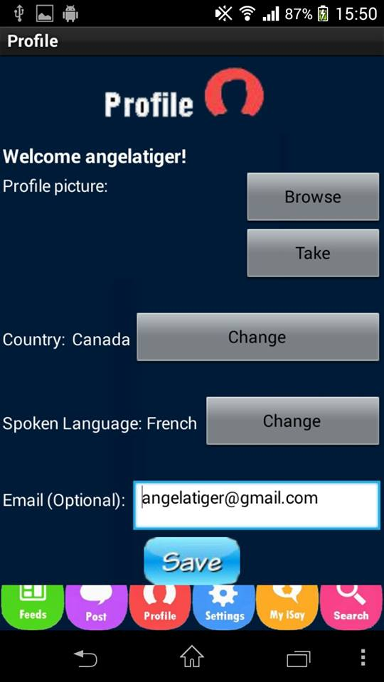
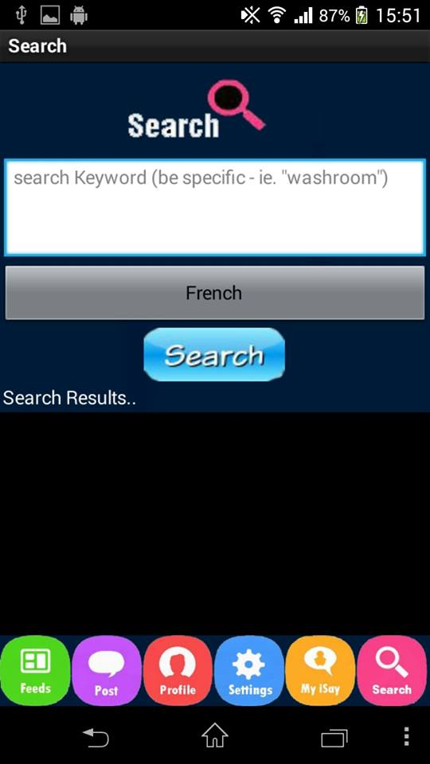

# iSay
iSay is designed for tourists who need an efficient and easy way to communicate in the country they are visiting. Often, tourists will visit a country and they just a simple way to have access to everyday phrases such as “Where is the bathroom?” or “What are the directions to __?”. iSay makes obtaining these phrases an easy process all while maintaining that the translations are correct and within context.

## Origins

iSay was our submission for the 2015 Technovation Challenge. I did all the programming in MIT app inventor while embedding SQL for the purposes of storing and save data. Due to the limitations of App Inventor, a source code can not be provided.

  
  
  

## Full App Description
All users will first be asked to make an account in iSay. Then, they fill out information like their native language, where they currently live, and what languages they often speak. Users can then choose which language they wish to have their phrase translated into. Then, they simply enter the keyword they want translated in the search bar and view translations if their question has already been asked, similar questions, or wait until someone answers their question and translates their phrase. Users can also choose how many responses they want to see in each page of their feed. 

One function iSay has is that users can vote thumbs up or thumbs down on certain responses and in a feed, it will always be ordered with the most thumbs up responses at the top. 

Another function is that phrases can be saved for offline storage. If a user sees a translation they wish to quickly access in the future, they simply hit ‘save’ and it saves into their account. Next time they want to see the phrase, no wifi/data (roaming) is required. In the free version, a maximum of 10 phrases can be saved. Also in the free version, there is a limit of only being able to post 3 iSays a day.

In the free version, users can visit others’ profiles and see information like their native languages, nationality, etc.  In the premium reason, there will be another feature called Statistics. Users can visit others’ profiles and also see how many questions they have asked/responded to and how many of them have received thumbs up/down. This can used to determine if the person is “trustworthy” or not; should they respond to your question. Also, users will be able to add friends and message each other. For a small cost, users can also transport their question to the “urgent” spots - At the top of every feed list.

iSay can also be used for student who need translations to certain expressions, slang, etc. iSay provides a very simple method to cross the language barrier and it keeps it all in the back of your pocket. Even better, iSay is done by natives to learners so it does not the robotic word-by-word translations online softwares do. This guarantees that the answers received are correct and within context.iSay is designed for tourists who need an efficient and easy way to communicate in the country they are visiting. Often, tourists will visit a country and they just a simple way to have access to everyday phrases such as “Where is the bathroom?” or “What are the directions to __?”. iSay makes obtaining these phrases an easy process all while maintaining that the translations are correct and within context.

All users will first be asked to make an account in iSay. Then, they fill out information like their native language, where they currently live, and what languages they often speak. Users can then choose which language they wish to have their phrase translated into. Then, they simply enter the keyword they want translated in the search bar and view translations if their question has already been asked, similar questions, or wait until someone answers their question and translates their phrase. Users can also choose how many responses they want to see in each page of their feed. 

One function iSay has is that users can vote thumbs up or thumbs down on certain responses and in a feed, it will always be ordered with the most thumbs up responses at the top. 

Another function is that phrases can be saved for offline storage. If a user sees a translation they wish to quickly access in the future, they simply hit ‘save’ and it saves into their account. Next time they want to see the phrase, no wifi/data (roaming) is required. In the free version, a maximum of 10 phrases can be saved. Also in the free version, there is a limit of only being able to post 3 iSays a day.

In the free version, users can visit others’ profiles and see information like their native languages, nationality, etc.  In the premium reason, there will be another feature called Statistics. Users can visit others’ profiles and also see how many questions they have asked/responded to and how many of them have received thumbs up/down. This can used to determine if the person is “trustworthy” or not; should they respond to your question. Also, users will be able to add friends and message each other. For a small cost, users can also transport their question to the “urgent” spots - At the top of every feed list.

iSay can also be used for student who need translations to certain expressions, slang, etc. iSay provides a very simple method to cross the language barrier and it keeps it all in the back of your pocket. Even better, iSay is done by natives to learners so it does not the robotic word-by-word translations online softwares do. This guarantees that the answers received are correct and within context.
